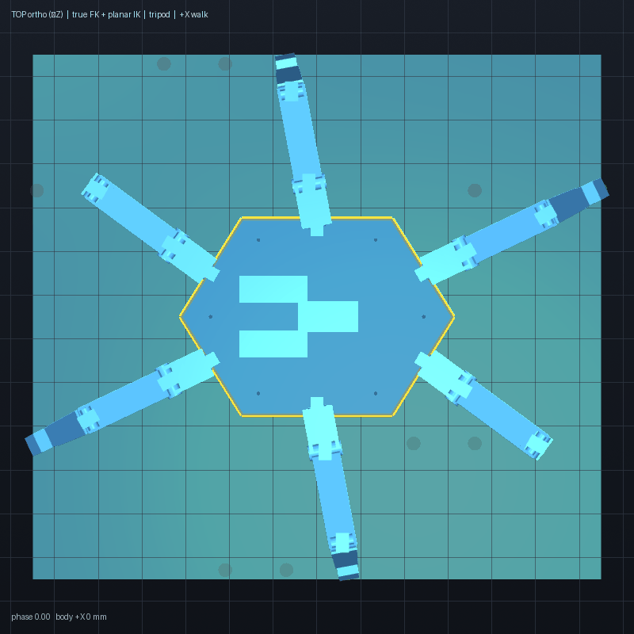
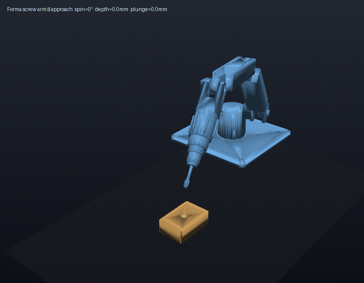
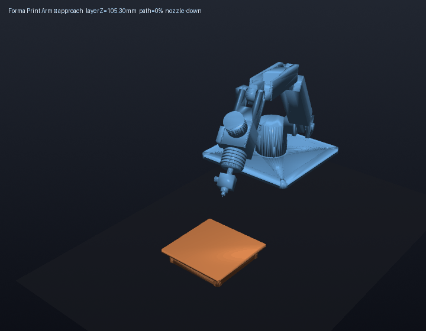
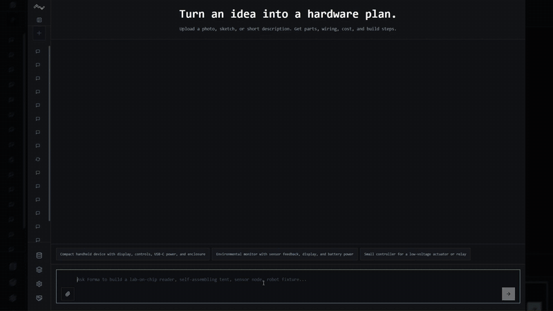

# Forma

**Build hardware from ideas.**

Forma is an open-source AI hardware design workspace. Describe a design, add reference images, and iterate toward CAD models, wiring diagrams, bills of materials, and assembly instructions.

[](LICENSE)
[](https://pypi.org/project/caid-forma-core/)
[](https://github.com/caid-technologies/Forma-OSS)

**[Try Forma](https://caid-technologies.us/)** · [Browse projects](https://caid-technologies.us/projects) · [Run locally](#quick-start) · [Documentation](docs/README.md)

## See it in action

Mechanical design and motion previews:

| Hexapod walking | Screw-driven arm | Robotic 3D printer |
| --- | --- | --- |
|  |  |  |

[Watch the full walkthrough: designing a security camera →](https://www.youtube.com/watch?v=XaIIJT7OX4M)

<details>
<summary>Preview the security camera workflow</summary>

[](https://www.youtube.com/watch?v=XaIIJT7OX4M)

</details>

## What you can build

- **CAD you can take with you.** Preview mechanical designs in 3D and export STEP, STL, 3MF, and OBJ from supported native CAD builds.
- **Electronics with the details attached.** Generate a bill of materials, interactive wiring diagrams, and assembly instructions. Rule-based checks flag shorts, voltage mismatches, pin conflicts, and other electrical issues.
- **Designs you can keep refining.** Use follow-up instructions to change geometry, dimensions, placement, and requirements within an existing project.
- **Mechanisms you can inspect.** Play, pause, and scrub supported joint-driven motion previews, including the [two meshing gears example](docs/gear-motion-preview.md).
- **Hardware workflows for your agents.** Use Forma through the web app, Python package, CLI, or MCP. The shared skill works with OpenCode, Claude Code, Codex, OpenClaw, and NemoClaw.

Forma is an **alpha research prototype** for makers and developers. Electrical validation focuses on 3.3–5 V educational projects; CAD and motion previews still need engineering review before fabrication. See [scope and validation](docs/validation.md).

## Quick start

Use [Forma in your browser](https://caid-technologies.us/), or run it locally with OpenCode. Local authoring, validation, rendering, and project status do not require a Forma account.

### Run locally with OpenCode

You need **Python 3.11+**, **Node.js and npm** (Node.js 22+ recommended), **Git**, and **OpenCode** with a working model connection. Your model provider's usage charges still apply.

**macOS / Linux**

```bash
curl --proto '=https' --tlsv1.2 -fsSL https://raw.githubusercontent.com/caid-technologies/Forma-OSS/main/scripts/development/install-opencode.sh | bash
```

**Windows PowerShell**

```powershell
irm https://raw.githubusercontent.com/caid-technologies/Forma-OSS/main/scripts/development/install-opencode.ps1 | iex
```

The installer creates `~/forma-workspace`, adds the Forma skill and MCP connection, installs missing app dependencies, and starts the backend and frontend. Keep that terminal open, then open a second terminal:

```sh
cd ~/forma-workspace
opencode mcp list
opencode
```

Try a first prompt:

> Design a 3.3 V temperature monitor with an OLED display. Include a bill of materials, wiring, and an enclosure.

Open the local UI at [localhost:3000](http://localhost:3000). CAD generation and exports also require the [native OpenCAD setup](docs/agent-clients.md#cad-skill-dependency). For installation details and troubleshooting, see the [setup guide](docs/setup.md).

<details>
<summary>Develop from source, use Docker, or install the Python core</summary>

Clone the repository and start the app:

```bash
git clone https://github.com/caid-technologies/Forma-OSS.git
cd Forma-OSS
./scripts/development/dev.sh
```

On Windows, replace the last command with `.\scripts\development\dev.ps1`.

The launcher starts the API and UI with local authentication and SQLite. Configure an [agent connection](docs/agent-clients.md) or a [model provider](docs/runtime-reference.md#shared-llm-configuration) for live generation.

For Docker, run `docker compose up --build` from the repository root. See [Docker setup](docs/setup.md#docker-setup) for configuration and persistence.

For the reusable Python core and CLIs:

```bash
pip install caid-forma-core
forma-core --help
forma-oss --help
```

See the [CLI and runtime reference](docs/runtime-reference.md) for generation, iteration, local credentials, and cloud sync.

</details>

## How it works

1. **Describe the project.** Start with requirements and optional reference images; refine the design through conversation.
2. **Author a structured design.** An agent produces [Hardware Intermediate Representation](docs/hardware-ir.md), Forma's typed, versioned representation of components, connections, geometry, and project history.
3. **Compile and inspect.** Forma validates the design and produces schematics, previews, and supported CAD artifacts. Iterate on the saved project as your requirements change.

With the local agent workflow, your host agent supplies the model and Forma performs deterministic compilation. The reusable `forma_core` package also supports server-side generation. See [architecture](docs/architecture.md) and [agent integrations](docs/agent-clients.md).

## Go deeper

| I want to… | Start here |
| --- | --- |
| Install or self-host Forma | [Setup](docs/setup.md) · [CLI and runtime reference](docs/runtime-reference.md) |
| Connect my own agent | [Agent integrations](docs/agent-clients.md) · [Model and image configuration](docs/opencode-models-and-images.md) |
| Understand the project format | [Hardware Intermediate Representation](docs/hardware-ir.md) · [Architecture](docs/architecture.md) |
| Explore examples and motion | [Examples](docs/examples.md) · [Gear motion preview](docs/gear-motion-preview.md) |
| Reconstruct CAD history in Onshape, NX, or Fusion | [AI-assisted CAD migrations](docs/ai-cad-migrations.md) |
| Contribute or evaluate results | [Contributing](CONTRIBUTING.md) · [Development](docs/development.md) · [Evaluations](evals/README.md) |

[All documentation](docs/README.md) · [Roadmap](docs/roadmap.md) · [Report a bug](https://github.com/caid-technologies/Forma-OSS/issues/new/choose)

## Build with us

Try a design, share what worked, or help improve CAD generation, validation, examples, and the interface. Read [CONTRIBUTING.md](CONTRIBUTING.md) for the contribution workflow.

**If you want open-source hardware design to be easier, star Forma to follow its progress and help other builders find it.**

Built by [Caid Technologies](https://caid-technologies.us/). Licensed under the [Mozilla Public License 2.0](LICENSE).
