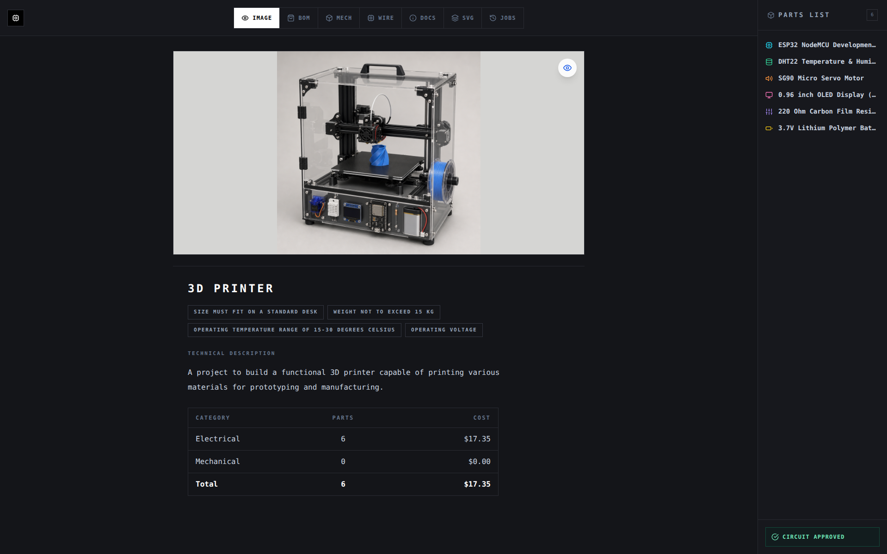

# Forma

Forma is AI-native full-stack hardware. It turns a prompt (and optionally an image) into a structured, validated **Hardware IR** package plus generated product imagery, wiring diagrams, BOM, and build steps.

This repository is an **MVP and research prototype** focused on **low-voltage maker electronics** (3.3V–5V) and safe, educational projects.



## What you can do
- Compile a hardware idea into typed **Hardware IR** (Pydantic)
- Run **rule-based electrical validation** (shorts, voltage mismatch, unpowered ICs, pin conflicts, overcurrent risk)
- Visualize wiring with:
  - Interactive **React Flow** schematic
  - Generated **SVG** schematic
- View a lightweight **3D mechanical layout** (Three.js / React Three Fiber)
- Generate an optional **product concept image** with an image model
- Persist generated projects to **Supabase** through the Supabase client when configured, with an automatic **SQLite fallback** and `BLUEPRINT_DEV_MODE` for SQLite-only local work
- Trace generation runs and structured LLM calls with **Langfuse** when project keys are configured
- Let external agents integrate over **REST long-polling, WebSocket, optional TCP JSONL sockets, or MCP-style JSON-RPC tools**

## How it works

Forma follows a sequential processing pipeline:

1. **Input**: User provides a prompt and optional image
2. **Agent Processing**: ADK-style sequential agents process the input using the configured structured LLM provider
3. **Hardware IR Generation**: Agents produce typed Hardware IR (Pydantic models)
4. **Validation & Repair**: Rule-based validation checks the design and repairs issues automatically
5. **UI Outputs**: Generate interactive visualizations (product image, React Flow schematic, SVG diagrams, 3D mechanical layout) and save to database
6. **Persistence**: Project data is stored in Supabase or SQLite

## MVP scope & safety boundaries
Forma intentionally limits scope to low-voltage maker electronics:
- 3.3V–5V DC systems
- Breadboard-friendly microcontrollers, sensors, displays, and actuators
- Educational and hobbyist prototypes

It blocks or warns on high-risk domains (mains AC, medical, automotive control, weapons, high-power battery packs). See [docs/validation.md](docs/validation.md).

## Local setup (quick)
Detailed instructions live in [docs/setup.md](docs/setup.md). The short version:

### Run Everything
From the repo root:

```bash
./scripts/development/dev.sh
```

This starts the FastAPI backend and Next.js frontend together. Use `BACKEND_PORT`, `FRONTEND_PORT`, `BACKEND_HOST`, or `FRONTEND_HOST` to override defaults.

### Python Package (PyPI)
The reusable core is published on PyPI as [`caid-blueprint-core`](https://pypi.org/project/caid-blueprint-core/). The distribution name is `caid-blueprint-core`; the Python import package is `blueprint_core`.

```bash
pip install caid-blueprint-core
```

```python
import blueprint_core
from blueprint_core.generation import HardwarePipelineOrchestrator, list_workflows
from blueprint_core.models import HardwareIR
```

### Docker
Build and run both images from the repo root:

```bash
docker compose up --build
```

The Docker setup runs the backend on port `8000`, the frontend on port `3000`,
Redis for project-list caching, and stores SQLite data in a named Docker volume.
Compose deliberately defaults to SQLite even if the repo `.env` configures a
host-side database. Set `COMPOSE_DATABASE_BACKEND=supabase` only with a
container-reachable `SUPABASE_URL`. Live model-provider variables still pass
through normally.

If you change the published backend URL, rebuild the frontend with a matching public API URL:

```bash
BACKEND_PORT=8010 NEXT_PUBLIC_API_URL=http://localhost:8010 docker compose up --build
```

### Backend (FastAPI)
From the repo root:

```bash
python3 -m venv .venv
source .venv/bin/activate
pip install -r apps/api/requirements.txt
```

**Optional: seed the component library**
The server auto-seeds the component library on startup if empty. To seed manually:

```bash
python3 apps/api/seed_db.py
```

**Run the backend:**
```bash
uvicorn apps.api.main:app --reload --port 8000
```

**Blueprint Core CLI:**

The core CLI runs generation, validation, and project iteration directly. It does not require the FastAPI backend.
Live CLI operations fail with a nonzero exit code when their requested provider, model, or pipeline fails; they never substitute another model or simulated project. Use `--simulation` only when deterministic simulated output is intentional.

```bash
blueprint-core workflows
blueprint-core namespaces
blueprint-core generate "plant watering monitor" --simulation --output project.json
blueprint-core generate "plant watering monitor" --llm openai/gpt-5.5 --output project.json
blueprint-core validate project.json
blueprint-core iterate project.json "Make the enclosure splash resistant" --namespace product.mech --output revised.json
python -m blueprint_core --help
```

**Developer utilities:**

```bash
./scripts/quality/test.sh
./scripts/models/sample.py "Describe a low-voltage plant watering monitor with OLED status"
./scripts/models/sample_async.py --llm openai/gpt-5.5 --llm runpod/caid-technologies/parti-base "Describe a low-voltage plant watering monitor with OLED status"
curl -X POST http://127.0.0.1:8000/projects/<project-id>/iterate -H 'Content-Type: application/json' -d '{"instruction":"Add battery charging and make the enclosure splash resistant","namespace":"product.mech","provider":"openai","model":"gpt-5.5"}'
./scripts/models/verify-llm-providers.py --list
./scripts/models/verify-llm-providers.py
./scripts/models/verify-llm-providers.py --save
./scripts/models/run-llm-smoke-tests.py
./scripts/models/verify-llm-providers.py --llm openai/gpt-5.5
./scripts/models/verify-llm-providers.py --llm runpod/caid-technologies/parti-base --timeout-seconds 1200
./scripts/models/verify-llm-providers.py --llm baseten/deepseek-ai/DeepSeek-V4-Pro
./scripts/models/verify-llm-providers.py --llm huggingface/Qwen/Qwen2.5-Coder-3B-Instruct:nscale
./scripts/models/verify-llm-providers.py --llm cloudflare/@cf/google/gemma-4-26b-a4b-it
./scripts/models/verify-llm-providers.py --llm nvidia/nvidia/z-ai/glm-5.2
```

`scripts/quality/test.sh` runs the offline unit suite with `unittest` after a Python compile check. `scripts/models/sample.py` sends the same prompt to each configured/allowed provider-model pair and saves a comparison report under `.logs/model-samples/`. `scripts/models/sample_async.py` does the same work concurrently, running one nonblocking task per selected model up to `--concurrency`. `verify-llm-providers.py` discovers the configured runtime provider/model pairs from `.env`, sends a tiny structured JSON prompt, and exits non-zero if any live provider returns invalid output. Use `--config-only` to validate selectors without spending tokens or waiting on long Runpod jobs. Use `--save` or `run-llm-smoke-tests.py` to write timestamped reports under `.logs/llm-smoke/`, plus `.logs/llm-smoke/latest.json`. The automated runner also accepts `LLM_SMOKE_LLM`, `LLM_SMOKE_CONFIG_ONLY`, `LLM_SMOKE_TIMEOUT_SECONDS`, and `LLM_SMOKE_OUTPUT_DIR` for CI or cron-style runs.

Generation and project iteration logic lives in the reusable `blueprint_core` package, published as the `caid-blueprint-core` PyPI distribution. New code should import from `blueprint_core.generation`, `blueprint_core.iteration`, `blueprint_core.project_objects`, `blueprint_core.models`, `blueprint_core.validation`, `blueprint_core.llm`, `blueprint_core.images`, `blueprint_core.runtime`, and `blueprint_core.selectors`; the old backend modules are compatibility wrappers. Projects are represented as `FormaProjectObject` values with an object version plus versioned namespaces such as `product.mech`, `product.electrical`, `product.validation`, `product.assembly`, `project.docs`, and `project.history`. `ProjectIterator.iterate_project(...)` takes an existing `HardwareIR` plus a natural-language instruction, can target a namespace, returns a full revised `HardwareIR`, normalizes revision/history/object metadata, redacts bulky data URLs from LLM context, and reruns circuit validation before returning. `ProjectSelfCorrectionAgent` builds validation-driven repair instructions and applies them through the same namespace-aware iterator.

Performance benchmarks live under `evals/performance/` and save JSON reports under `.logs/benchmarks/`. See [`evals/README.md`](evals/README.md) for the performance/quality distinction, shared datasets, reports, and extension guidance.
```bash
./scripts/quality/benchmark.sh
./evals/performance/benchmark_models.py --iterations 1
./evals/performance/benchmark_models.py --live --llm openai/gpt-5.5 --iterations 3 --concurrency 2
```

`benchmark_models.py` defaults to config-only mode so it can run safely without spending provider calls. Add `--live` when you want real LLM latency measurements. Each completed provider/model attempt is also flushed immediately to per-run JSONL and CSV files named `model-job-results-*.jsonl` and `model-job-results-*.csv`, including status, round, completion time, and duration fields.

Benchmark, output, and eval artifacts can be uploaded to a Hugging Face dataset repo:

```bash
export HF_TOKEN=...
export HF_ARTIFACT_REPO_ID=username/blueprint-metrics

./evals/performance/benchmark_models.py --live --iterations 3 --upload-huggingface
./evals/performance/benchmark_offline.py --upload-huggingface
./scripts/operations/upload-artifacts-to-huggingface.py --artifact-type outputs examples/results
./scripts/operations/upload-artifacts-to-huggingface.py --artifact-type evals .logs/evals
```

The CLI uses `.venv/bin/python` when present and falls back to `python3`. `health`
checks the root, component, and A2A jobs endpoints; `jobs --local` reads the
primary SQLite database directly when the API server is not running. Job
tables include the generation source when known: `Catalog`, `Web Research`, or
both.

To run with OpenAI:
```bash
LLM_PROVIDER=openai OPENAI_API_KEY=your_openai_api_key_here OPENAI_MODEL=gpt-4o-mini uvicorn apps.api.main:app --reload --port 8000
```

Environment variables (recommended via a repo-root `.env`; see `.env.example`):

#### Application, database, and authentication

- `LOG_LEVEL`: Backend logging level, for example `INFO` or `DEBUG`.
- `BACKEND_LOG_FILE`: Optional log file for backend and uvicorn logs, for example `./blueprint-backend.log`.
- `BLUEPRINT_DEBUG`: When `true`, API errors and failed job metadata include redacted traceback/context debug payloads. Intended for trusted local/dev environments.
- `SUPABASE_URL`: Supabase project API URL, for example `https://your-project-ref.supabase.co`.
- `SUPABASE_SERVICE_ROLE_KEY` / `SUPABASE_SECRET_KEY`: Backend-only Supabase key for writes. Do not use anon/publishable keys.
- `BLUEPRINT_DEV_MODE`: When `true`, forces the application database to SQLite, disables Supabase Storage writes, and keeps reference/product image data inline in the SQLite project record.
- `NEXT_PUBLIC_BLUEPRINT_DEBUG` / `NEXT_PUBLIC_BLUEPRINT_DEV_MODE`: Frontend-visible local/dev flags. The `Keys` integrations UI, `Listening Jobs`, and `Backend Logs` are shown only in Next development mode or when a debug/dev-mode flag is truthy. Keep these unset or `false` in public production builds.
- `DATABASE_BACKEND`: Optional override: `supabase` or `sqlite`.
- `BLUEPRINT_IMAGE_STORAGE_BACKEND`: Optional ancillary override (`supabase`, `s3-compatible`, or `local`). By default image storage follows `DATABASE_BACKEND`.
- `BLUEPRINT_WORKSPACE_INTEGRATIONS_BACKEND` / `BLUEPRINT_USER_INTEGRATIONS_BACKEND`: Optional encrypted-settings storage overrides. By default they follow `DATABASE_BACKEND`, so SQLite mode does not contact Supabase just because credentials are present.
- `SQLITE_DATABASE_URL`: SQLite fallback URL (default: `sqlite:///./blueprint.db`).
- `BLUEPRINT_DEPLOYMENT`: When `true`, generation requires a deployment provider or the signed-in user's BYOK provider; users without an active provider are directed to Settings.
- `BLUEPRINT_AUTH_MODE`: Explicitly `local` (Clerk is not mounted and settings belong to the local workspace) or `clerk` (sign-in is required and settings belong to the Clerk user).
- `BLUEPRINT_USER_SECRETS_KEY`: Required for every backend runtime. Startup fails immediately when it is absent. Use a high-entropy server-only value; it encrypts per-user settings and is the workspace-encryption fallback.
- `BLUEPRINT_WORKSPACE_SECRETS_KEY`: Optional separate high-entropy key for local/workspace settings. SQLite-primary runtimes use an encrypted file; Supabase-primary runtimes use encrypted `workspace_integration_configs` storage.

#### Shared LLM configuration

The backend publishes the resolved, credential-safe client contract at `GET /api/runtime/config`. Its precedence is explicit request override, saved integration, environment, then provider default. The web application uses this response for provider/model choices, image behavior, workflow defaults, and BYOK prompts instead of repeating configuration logic.

- `LLM_PROVIDER`: Live generation provider: `anthropic`, `baseten`, `gemini`, `gmi`, `huggingface`, `cloudflare`, `nvidia`, `openai`, `openai-compatible`, `runpod`, `runpod-serverless`, or `simulation`. Use `runpod` for Runpod OpenAI-compatible/vLLM endpoints and `runpod-serverless` for queue-style `/runsync` workers.
- `LLM_ALLOWED_PROVIDERS`: Optional comma-separated allowlist for per-request provider overrides.
- `OPENAI_ALLOWED_MODELS` / `ANTHROPIC_ALLOWED_MODELS` / `BASETEN_ALLOWED_MODELS` / `GEMINI_ALLOWED_MODELS` / `GMI_ALLOWED_MODELS` / `HUGGINGFACE_ALLOWED_MODELS` / `CLOUDFLARE_ALLOWED_MODELS` / `NVIDIA_ALLOWED_MODELS` / `OPENAI_COMPATIBLE_ALLOWED_MODELS` / `RUNPOD_ALLOWED_MODELS`: Optional comma-separated allowlists for per-request model overrides. Without an explicit allowlist, runtime overrides are limited to the configured default/fallback model for that provider.
- `/api/generate` also accepts optional `provider` and `model` fields for runtime switching. Each generated project records the requested provider/model and actual provider/model in `assembly_metadata`.
- In the Keys UI, users can set Runtime Defaults → Preferred model as `provider/model` (for example `anthropic/claude-sonnet-5` or `huggingface/Qwen/Qwen2.5-Coder-3B-Instruct:nscale`). Forma derives the runtime provider, model, provider allowlist, and model allowlist from saved keys/models automatically.
- `STRICT_LLM`: Set to `true` (default) to fail fast when model validation is enabled and the model is unavailable. Set to `false` to attempt fallback.
- `LLM_API_KEY`: Generic provider API key alias. For Gemini, `GEMINI_API_KEY` or `GOOGLE_API_KEY` still work.
- `LLM_MODEL`: Model to use, for example `gemini-3.5-flash` or an OpenAI/OpenAI-compatible model ID.
- `LLM_FALLBACK_MODEL`: Optional fallback model when `STRICT_LLM=false`.
- `LLM_BASE_URL`: Optional base URL for OpenAI-compatible providers.
- `LLM_TIMEOUT_SECONDS`: Generic read timeout. OpenAI-compatible endpoints default to `90`.
- `LLM_REASONING_EFFORT`: Optional generic reasoning effort for compatible endpoints that support it.
- `LLM_TEMPERATURE`: Optional generic sampling temperature. OpenAI-compatible endpoints default to `0.2`; set `default`, `none`, or `omit` to omit it.

<details>
<summary><strong>OpenAI</strong></summary>

- `OPENAI_API_KEY`: API key for first-party OpenAI when `LLM_PROVIDER=openai`.
- `OPENAI_MODEL`: OpenAI model ID. The example default is `gpt-4o-mini`.
- `OPENAI_RESPONSE_FORMAT`: OpenAI response format. Defaults to `json_schema`; `json_object` and `none` are also supported.
- `OPENAI_TIMEOUT_SECONDS`: First-party OpenAI read timeout. Defaults to `300`.
- `OPENAI_REASONING_EFFORT`: Optional reasoning effort for GPT-5/o-series models, for example `low`.
- `OPENAI_TEMPERATURE`: Optional first-party OpenAI sampling temperature. Omitted by default so models that only support their default temperature can run.
- `OPENAI_PROJECT_ID` / `OPENAI_ORG_ID`: Optional OpenAI project and organization routing headers.

</details>

<details>
<summary><strong>Anthropic</strong></summary>

- `ANTHROPIC_API_KEY` / `CLAUDE_API_KEY`: Anthropic Claude API key when `LLM_PROVIDER=anthropic` or a request uses `provider=anthropic`.
- `ANTHROPIC_MODEL`: Claude model ID. The example default is `claude-sonnet-5`.
- `ANTHROPIC_BASE_URL`: Claude API base URL. Defaults to `https://api.anthropic.com/v1`.
- `ANTHROPIC_JSON_SCHEMA_OUTPUT`: Defaults to `true` and sends Claude JSON schema output config; set `false` to fall back to prompt-only JSON instructions.

</details>

<details>
<summary><strong>Baseten</strong></summary>

- `BASETEN_API_KEY` / `BASETEN_BASE_URL`: Baseten Model APIs configuration when `LLM_PROVIDER=baseten` or a request uses `provider=baseten`. `BASETEN_BASE_URL` defaults to `https://inference.baseten.co/v1`.
- `BASETEN_MODEL`: Baseten model slug, for example `deepseek-ai/DeepSeek-V4-Pro`.

</details>

<details>
<summary><strong>Gemini</strong></summary>

- `GEMINI_API_KEY` / `GOOGLE_API_KEY`: Gemini credentials when `LLM_PROVIDER=gemini` or a request uses `provider=gemini`.
- `GEMINI_MODEL`: Gemini model ID. The example default is `gemini-3.5-flash`.

</details>

<details>
<summary><strong>GMI Cloud</strong></summary>

- `GMI_API_KEY` / `GMI_BASE_URL`: GMI Cloud configuration when `LLM_PROVIDER=gmi` or a request uses `provider=gmi`.
- `GMI_MODEL`: GMI model ID.

</details>

<details>
<summary><strong>Hugging Face</strong></summary>

- `HF_TOKEN` / `HUGGINGFACE_API_KEY` / `HUGGINGFACE_HUB_TOKEN`: Hugging Face Inference Providers token when `LLM_PROVIDER=huggingface` or a request uses `provider=huggingface`.
- `HUGGINGFACE_BASE_URL`: Hugging Face OpenAI-compatible router URL. Defaults to `https://router.huggingface.co/v1`.
- `HUGGINGFACE_MODEL`: Hugging Face model ID, for example `Qwen/Qwen2.5-Coder-3B-Instruct:nscale`.

</details>

<details>
<summary><strong>Cloudflare</strong></summary>

- `CLOUDFLARE_API_TOKEN` / `CLOUDFLARE_ACCOUNT_ID`: Cloudflare AI credentials when `LLM_PROVIDER=cloudflare` or a request uses `provider=cloudflare`. The OpenAI-compatible base URL is derived as `https://api.cloudflare.com/client/v4/accounts/<account_id>/ai/v1`; `CLOUDFLARE_BASE_URL` can override it.
- `CLOUDFLARE_MODEL`: Cloudflare Workers AI model ID. Defaults to the Free-plan-compatible `@cf/google/gemma-4-26b-a4b-it`.
- `CLOUDFLARE_RESPONSE_FORMAT`: Cloudflare response format. Defaults to `json_schema`; `json_object` and `none` are also supported.
- `CLOUDFLARE_ENABLE_THINKING`: Enables Cloudflare model-native thinking for structured requests. Defaults to `false` so reasoning cannot consume the entire JSON output budget.

</details>

<details>
<summary><strong>NVIDIA</strong></summary>

- `NVIDIA_API_KEY` / `NVIDIA_BASE_URL`: NVIDIA Build/NIM configuration when `LLM_PROVIDER=nvidia` or a request uses `provider=nvidia`. `NVIDIA_BASE_URL` defaults to `https://integrate.api.nvidia.com/v1`.
- `NVIDIA_MODEL`: NVIDIA model slug, for example `nvidia/z-ai/glm-5.2`.

</details>

<details>
<summary><strong>OpenAI-compatible providers</strong></summary>

Use the shared `LLM_API_KEY`, `LLM_MODEL`, and `LLM_BASE_URL` variables with `LLM_PROVIDER=openai-compatible`. Provider-specific response format, validation, timeout, token, reasoning, and temperature variables are listed in `.env.example`.

</details>

<details>
<summary><strong>Runpod</strong></summary>

- `RUNPOD_API_KEY` / `RUNPOD_OPENAI_BASE_URL`: Runpod OpenAI-compatible/vLLM configuration when `LLM_PROVIDER=runpod` or a request uses `provider=runpod`.
- `RUNPOD_ENDPOINT_ID` / `RUNPOD_ENDPOINT_URL`: Runpod Serverless queue configuration when `LLM_PROVIDER=runpod-serverless` or a request uses `provider=runpod-serverless`.
- `RUNPOD_MODEL_ENDPOINTS`: Optional JSON mapping of Runpod model IDs to endpoint IDs or endpoint URLs when each model uses a different Serverless endpoint.
- A plain Runpod queue URL such as `https://api.runpod.ai/v2/<endpoint-id>` belongs in `RUNPOD_ENDPOINT_URL` with `LLM_PROVIDER=runpod-serverless`; `LLM_PROVIDER=runpod` requires the OpenAI-compatible base URL ending in `/openai/v1`.
- `RUNPOD_TIMEOUT_SECONDS`: Runpod HTTP read timeout. Defaults to `1200` so 10-15 minute cold starts or long generations can finish.
- `RUNPOD_POLL_TIMEOUT_SECONDS`: Runpod Serverless `/status` polling timeout. Defaults to `1200`.
- `RUNPOD_EXECUTION_TIMEOUT_MS` / `RUNPOD_TTL_MS`: Runpod Serverless job policy values. Use `1200000` for 20-minute generation windows.
- `RUNPOD_PARTI_SEED_TIMEOUT_SECONDS`: Optional timeout just for the `caid-technologies/parti-base` seed call. Defaults to `RUNPOD_TIMEOUT_SECONDS`; set lower if you prefer fast catalog repair when Parti is slow.
- `RUNPOD_INPUT_TEMPLATE`: Optional JSON payload template for Runpod workers. Use `{prompt}` and, for single-endpoint multi-model workers, `{model}` placeholders.

</details>

#### Observability, media, storage, and external sources

- `LANGFUSE_PUBLIC_KEY` / `LANGFUSE_SECRET_KEY`: Optional Langfuse project keys. When both are set, the backend traces each generation request and structured LLM call.
- `LANGFUSE_BASE_URL`: Optional Langfuse host (default `https://cloud.langfuse.com`).
- `LANGFUSE_TRACING_ENVIRONMENT` / `LANGFUSE_TRACING_RELEASE`: Optional Langfuse trace attributes.
- `LANGFUSE_MAX_FIELD_CHARS`: Optional traced payload preview cap (default `20000`).
- `LANGFUSE_ENABLED`: Optional explicit on/off switch. Set to `false` to disable tracing even when keys are present.
- `IMAGE_OUTPUT_ENABLED`: Optional global default for generated product images. The UI and API can opt in per job with `generate_image=true`.
- `IMAGE_PROVIDER`: Image provider. Supports `openai`, `openai-compatible`, or `none`.
- `OPENAI_IMAGE_MODEL`: OpenAI image model ID. The example default is `gpt-image-2`.
- `OPENAI_IMAGE_SIZE`: Generated image size, for example `1024x1024`.
- `OPENAI_IMAGE_API_KEY` / `OPENAI_API_KEY`: First-party OpenAI image credentials. `IMAGE_PROVIDER=openai` does not inherit `LLM_API_KEY` or `LLM_BASE_URL`; use `IMAGE_PROVIDER=openai-compatible` plus `IMAGE_BASE_URL`/`IMAGE_API_KEY` or `LLM_BASE_URL`/`LLM_API_KEY` for compatible image endpoints.
- `FIREWORKS_API_KEY`: Enables Video tab self-correction. Auto mode samples the saved video with `ffmpeg`, reviews frames with the Fireworks `kimi-k2p6` image-input model, then applies the review through `ProjectIterator`.
- `FIREWORKS_VIDEO_REVIEW_INPUT_MODE`: `auto` by default. Auto uses the working `kimi-k2p6` frame-review fallback unless native video deployment routing is configured.
- `FIREWORKS_ACCOUNT_ID` / `FIREWORKS_VIDEO_REVIEW_DEPLOYMENT_ID`: Optional Fireworks dedicated deployment routing for native video/audio models. With these set and no explicit frame model override, auto mode uses `qwen3-omni-30b-a3b-instruct`.
- `FIREWORKS_VIDEO_REVIEW_MODEL`: Fireworks review model slug or full deployment path. Defaults to `kimi-k2p6` for frame review. For native video, use `qwen3-omni-30b-a3b-instruct`, `molmo2-4b`, `molmo2-8b`, or a full `accounts/<account>/models/<model>#accounts/<account>/deployments/<deployment>` path.
- `FIREWORKS_BASE_URL` / `FIREWORKS_VIDEO_REVIEW_MAX_FRAMES` / `FIREWORKS_VIDEO_REVIEW_MAX_SECONDS` / `FIREWORKS_VIDEO_REVIEW_NATIVE_FPS` / `FIREWORKS_VIDEO_REVIEW_NATIVE_HEIGHT` / `FIREWORKS_VIDEO_REVIEW_MAX_MEDIA_BYTES` / `FIREWORKS_TIMEOUT_SECONDS`: Optional Fireworks video-review endpoint, preprocessing, and timeout overrides.
- `SUPABASE_S3_ENDPOINT`: Explicit S3-compatible image-storage endpoint. Supabase-client uploads derive their endpoint from `SUPABASE_URL`; direct S3-compatible uploads require this value.
- `SUPABASE_S3_BUCKET`: Supabase Storage bucket for image uploads (default: `contents`).
- `SUPABASE_S3_ACCESS_KEY_ID` / `SUPABASE_S3_SECRET_ACCESS_KEY`: Optional S3-compatible fallback credentials. The normal backend path uploads through the Supabase client with `SUPABASE_URL` plus the service-role/secret key.
- `SUPABASE_IMAGE_SIGNED_URL_SECONDS`: Lifetime for refreshed Supabase Storage read URLs when projects are loaded (default: `86400`).
- `HF_ARTIFACT_REPO_ID` / `HUGGINGFACE_ARTIFACT_REPO_ID` / `HF_DATASET_REPO_ID`: Optional Hugging Face dataset repo for uploaded benchmark, output, and eval artifacts.
- `HF_ARTIFACT_PATH_PREFIX`: Optional path prefix inside the artifact repo. Defaults to `blueprint`.
- `EXTERNAL_SOURCE_PROVIDER`: External web/source provider for `workflow=web_research`. Firecrawl is the only active provider for now; legacy `auto` or `tavily` values are normalized to `firecrawl`.
- `BLUEPRINT_DEFAULT_GENERATION_WORKFLOW`: Initial frontend workflow, either `web_research` (default) or `default` (Catalog). Request-level workflow selections take precedence.
- `FIRECRAWL_API_KEY` / `FIRECRAWL_MCP_COMMAND`: Enable Firecrawl MCP search and page extraction for the web research workflow.
- `FIRECRAWL_SEARCH_LIMIT` / `FIRECRAWL_MCP_TIMEOUT_SECONDS`: Firecrawl search controls for the web research workflow.

#### A2A jobs

- A2A jobs use the database selected by `DATABASE_BACKEND` and `SQLITE_DATABASE_URL`; there is no separate job database.
- `A2A_SOCKET_ENABLED`: Set to `true` to start the optional TCP JSONL A2A socket.
- `A2A_SOCKET_HOST` / `A2A_SOCKET_PORT`: Host and port for the optional TCP JSONL listener.

If no live LLM provider is configured or generation fails, the backend returns deterministic simulation outputs based on built-in example projects.

### Frontend (Next.js)
```bash
cd apps/web
npm install
npm run dev
```

Open:
- http://localhost:3000 (UI)
- http://localhost:8000/api/docs (API docs)

Tip: load an example directly with http://localhost:3000/?example=pocket_mp3_player (or any JSON under `apps/web/public/examples/`).

## Documentation
- [Architecture](docs/architecture.md)
- [DesignBrief contract](docs/design-brief.md)
- [Worker contracts and capability registry](docs/worker-contracts.md)
- [Project workflow state machine](docs/project-workflow.md)
- [Conversational context gathering](docs/context-gathering.md)
- [Project readiness and build initiation](docs/project-readiness.md)
- [Agents](docs/agents.md)
- [Hardware IR](docs/hardware-ir.md)
- [Validation](docs/validation.md)
- [Database](docs/database.md)
- [A2A](docs/a2a.md)
- [Backend](docs/backend.md)
- [Frontend](docs/frontend.md)
- [Setup](docs/setup.md)
- [Development](docs/development.md)
- [Examples](docs/examples.md)
- [Roadmap](docs/roadmap.md)
- [Legal and policy drafts](docs/legal/README.md)
