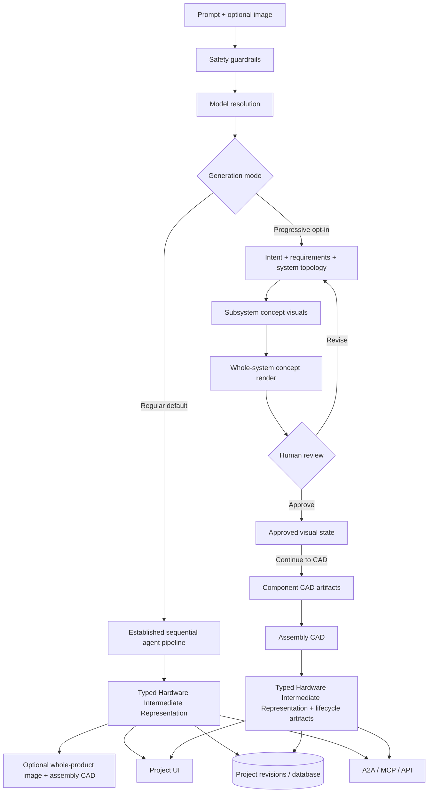

# Architecture

Forma OSS turns prompts into structured hardware projects with two explicit generation strategies. **Regular** is the default one-shot path and preserves the established sequential workflow. **Progressive** is opt-in and resolves the same canonical hardware project at progressively more expensive levels of fidelity so concept work can be reviewed before CAD.

## Generation modes

### Regular (default)

Regular generation keeps the existing interaction and execution model:

1. **Prompt + optional image** enters the system.
2. **Safety guardrails** block high-risk domains early.
3. **Model resolution** selects live LLM generation or deterministic simulation fallback.
4. **Intent + requirements** establish the project goal and constraints.
5. **Component selection, wiring, validation, BOM, mechanical, and assembly agents** produce the project in the established sequential pipeline.
6. **Hardware Intermediate Representation** is persisted as the canonical structured project.
7. Optional **whole-product image** and **native assembly CAD** outputs are generated directly when requested.
8. The finished project is rendered in the UI and exposed through the existing API/A2A surfaces.

Regular generation does **not** create subsystem visuals, wait on a visual approval gate, or require component-CAD-first assembly. The absence of a persisted `generation_mode` also resolves to Regular so existing projects and callers retain their behavior.

### Progressive (explicit opt-in)

Progressive generation uses the same `HardwareIntermediateRepresentation`, `SystemArchitecture`, and agent primitives, but adds a durable cost-aware design lifecycle:

```text
User intent
  ↓
Requirements + canonical system topology
  ↓
Component/object resolution
  ↓
Per-system concept visuals
  ↓
Whole-system concept render
  ↓
Persisted human review
  ├─ Revise → return to the cheapest affected representation
  └─ Approve
       ↓
   Continue to CAD
       ↓
   Component CAD artifacts
       ↓
   Assembly CAD
       ↓
   Verification / manufacturing outputs
```

The mode is persisted as `assembly_metadata.generation_mode = "progressive"`. Progressive-only metadata such as a design brief or visual approval policy does not opt a project into this lifecycle by itself.

Derived representations are tracked by `forma_core/workspaces/projects/design_lifecycle.py`. Each artifact can record its owner node, fidelity, source fingerprint, dependency artifact IDs, status, and coarse execution cost. This allows downstream work to be selectively invalidated instead of replaying every stage after every change.

The whole-system visual gate is resumable. **Approve concept** records acceptance without invoking CAD, **Revise** persists feedback/rejection, and **Continue to CAD** is the explicit higher-cost transition that generates/reuses component CAD before assembly CAD. Decisions are committed as project revisions, so they survive navigation, reconnects, and process restarts.

## Orchestration and model runtime
- **Regular** runs the established ADK-style sequential workflow implemented in `forma_core/agents/orchestrator.py`; **Progressive** reuses those stages while layering persisted cost/fidelity metadata, representation fingerprints, selective invalidation, and review gates around expensive outputs.
- Live structured JSON output is routed through the reusable `forma_core.llm` package API.
- Shared generation, provider, validation, model, and runtime utilities live under `forma_core` so the backend, CLI, smoke tests, and future workers use the same implementation.
- External service adapters live under `forma_core/integrations/`; Hugging Face artifact packaging and uploads are grouped under `integrations/huggingface/`.
- Supported providers are `vertex`, `anthropic`, `baseten`, `gemini`, `gmi`, `huggingface`, `cloudflare`, `nvidia`, `openai`, `openai-compatible`, `runpod`, `runpod-serverless`, and `simulation`.
- Generic configuration uses `LLM_PROVIDER`, `LLM_API_KEY`, `LLM_MODEL`, `STRICT_LLM`, and `LLM_FALLBACK_MODEL`.
- `forma_core.config` is the dedicated configuration package. Its exported `config` singleton is the sole Python process-environment boundary; runtime resolution and the credential-safe client contract live in `forma_core.config.runtime` and `forma_core.config.contract`. Legacy runtime-config module paths are compatibility shims only.
- Backend, core, CLI, example, evaluation, and maintenance modules use the config object's read, parse, snapshot, mutation, replacement, and temporary-override APIs instead of accessing `os.getenv` or `os.environ` directly.
- `apps/web/lib/config/` is the corresponding web configuration package: `environment.ts` is the sole Next.js build/server environment boundary, while `runtime.ts` defines the backend-owned runtime contract consumed by the UI.
- `/api/generate` can override the provider and model at runtime with optional `provider` and `model` fields. Overrides are checked against `LLM_ALLOWED_PROVIDERS` and provider-specific model allowlists before generation starts.
- `forma_core.config.contract.resolve_runtime_contract()` is the single client-facing configuration authority. It resolves request/saved/environment/default precedence and publishes LLM options, image defaults, workflow defaults, generation readiness, and BYOK requirements through `GET /api/runtime/config`.
- Environment variables and encrypted integration records are input adapters. The web application does not merge them or derive provider readiness independently.
- Gemini-specific variables (`GEMINI_API_KEY`, `GOOGLE_API_KEY`, `GEMINI_MODEL`, `STRICT_GEMINI`, `GEMINI_FALLBACK_MODEL`) remain supported as compatibility aliases.
- Vertex AI is the recommended primary provider and uses Google Cloud ADC with `GOOGLE_CLOUD_PROJECT`, `GOOGLE_CLOUD_LOCATION`, and `VERTEX_AI_MODEL`.
- If no API key is configured (or generation errors), the backend uses a deterministic simulation fallback backed by curated example projects.

## System diagram


## Core subsystems
- **Frontend (Next.js + React Flow):** Visualizes the structured project, nets, BOM, and instructions.
- **Backend (FastAPI):** Hosts the orchestration layer, validation, and storage APIs.
- **A2A broker:** Lets external agents register, send messages, listen for queued events, or call Forma tools through MCP-style JSON-RPC.
- **Fabricator (`forma_core.fabricator`):** Provides reusable fabrication-planning schemas, heuristics, Lattice registration, and the `fabricator` CLI.
- **Rust integrations ([`isayahc/Forma-Rust`](https://github.com/isayahc/Forma-Rust)):** Host the Forma TUI, low-level source listeners, and Linux-facing integrations as standalone Rust projects.
- **Database (Supabase client/SQLite):** Stores component templates and generated projects.
- **Utilities:** Render Mermaid and SVG schematics from the IR.

## Output artifacts
- **Hardware Intermediate Representation JSON** (typed source of truth)
- **React Flow schematic** (interactive wiring view)
- **SVG schematic** (static vector view)
- **Mermaid diagram** (lightweight topology graph)
- **BOM + assembly steps**
