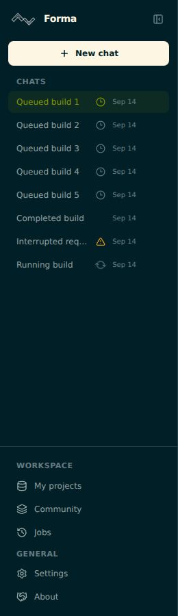

# Chat activity recovery

Sidebar activity previously came from any saved message with `status: loading`.
Context-build snapshots with `buildExecution.status: planned` or `running` normalize
to that status, even when the outer saved message is complete. The snapshot is
not proof that a worker is currently running. Old loading messages without a
recoverable operation could also keep a chat spinning indefinitely.

The sidebar now checks all recoverable pending operations, including unopened
chats. It uses existing build-plan and A2A job GET endpoints with the current
account's authentication. It never executes a saved build while loading history.

| Evidence | Sidebar display |
| --- | --- |
| Saved operation awaiting its first status check | Checking icon |
| Server reports planned, queued, pending, or leased | Clock |
| Server reports running, or a request is active in this browser | Spinner |
| Network failure or unrecognized status | Static reconnecting icon |
| Missing operation, missing permission, or no recoverable ID | Warning with explanation |
| Confirmed success, failure, partial result, or cancellation | No activity indicator; recovered outcome in the local thread |

Status reads run in batches of at most three, while the page is visible. Requests
time out after ten seconds. Temporary failures and missing records use longer
retry delays. Account changes abort pending requests and discard their results.
Missing records are never treated as success or cancellation.

Confirmed terminal results update the local chat projection; status reads do not
overwrite server chat history. Reloading checks a still-pending server snapshot
again. Existing explicit submit and retry actions retain their execution paths.
The live build watcher also releases its active state when its polling limit is
reached, allowing passive status recovery to continue.

## Validation

From `apps/web`:

```sh
npm run lint
npm run build
node --experimental-strip-types --test test/chat-activity.test.ts
```

The last command requires a recent Node version with native TypeScript stripping.
Twelve regression tests cover saved plans, legacy jobs, terminal outcomes,
unrecoverable messages, authentication failures, stale observations, and active
answer preservation. Eight existing connection-status tests were also run with
the TypeScript loader; all twenty tests passed. Lint passed with ten existing
image-element warnings, and the production build passed.

A Chromium check used eight synthetic chats and mocked API responses: five
queued plans, one completed plan, one interrupted request without an ID, and one
running A2A job. Desktop and mobile displayed one spinner. Opening a queued chat
and reloading generated zero build execution requests and no page errors.



## Release and existing histories

This change starts from `dev` at `db134b2e3788e7e71f9240c526459f2b4291302d`,
as required by `CONTRIBUTING.md`. The inspected production `main` revision,
`907ca55b5cf2553ae8270e2b7aa7aa98c1c12957`, contains newer workspace and sidebar
changes. A direct application of this patch to that revision does not apply
cleanly. Integrate current production changes into the development release and
resolve these files before promotion; do not replace production files with their
older development versions.

Before release, verify in staging with authenticated API responses:

1. Refresh with several pending chats, including chats that remain unopened.
2. Confirm queued plans do not spin and confirmed running jobs do.
3. Confirm terminal jobs settle and missing jobs retain an unknown outcome.
4. Open an old queued chat and confirm Network shows no `POST .../execute`.
5. Check sign-out, account switching, temporary connection loss, and both desktop
   and mobile sidebars. Include the current production maintenance mode.
6. Submit a new build explicitly and verify progress and the final project result.

Promote through `dev` to `staging` to `main` after review. No schema migration or
mini-PC configuration change is required by this patch. After rollout, existing
pending snapshots are checked automatically. A genuinely stuck backend job still
needs its worker logs investigated; a missing operation cannot be assigned a
reliable historical outcome from the chat snapshot alone. The supplied chat
payload establishes the stale-display mechanism, not the live worker outcomes.

OpenCode command/session recovery across reloads is a separate follow-up; this
change does not add persistence for those identifiers.
