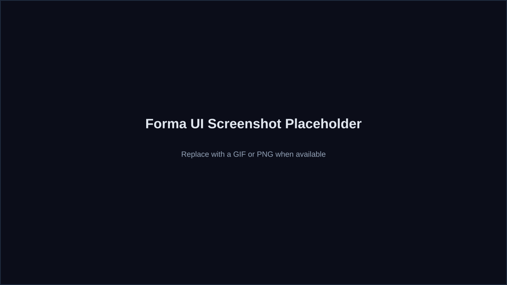

# Examples

Forma ships with a few example Hardware IR projects to make the MVP easy to explore without live agent calls.

## Example projects
- **Auto-Grow Plant Watering** (`examples/plant_watering.json`)
- **Smart Thermostat** (`examples/smart_thermostat.json`)
- **Biometric Deadbolt** (`examples/biometric_deadbolt.json`)
- **Pocket MP3 Player** (`examples/pocket_mp3_player.json`)
- **Print-in-Place Captive Hinge** (`examples/print_in_place_hinge.json`)
- **Monolithic Flexure Hinge** (`examples/monolithic_flexure_hinge.json`)

These same examples are mirrored in `apps/web/public/examples/` for quick UI loading.

You can deep-link an example in the UI:
- `http://localhost:3000/?example=pocket_mp3_player`
- `http://localhost:3000/?example=print_in_place_hinge&tab=mechanical`
- `http://localhost:3000/?example=monolithic_flexure_hinge&tab=mechanical`

## What each example includes
- Typed Hardware IR (overview, requirements, components)
- Nets and pin mappings
- BOM data and estimated cost
- Assembly steps and mechanical notes
- Validation summary

## Screenshot placeholder

## Tips
- Use these examples to test the UI and explore the IR schema.
- Modify the JSON locally to see how the UI renders different configurations.
